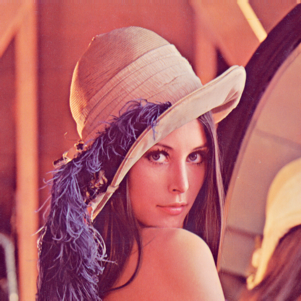
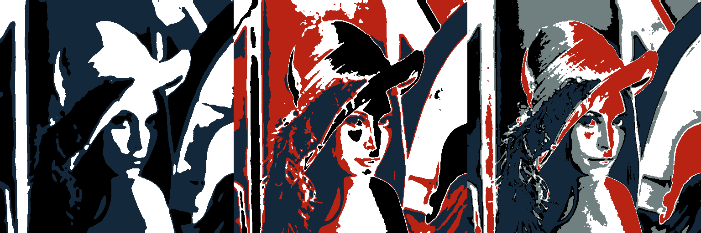

# Tritonize Web

This project brings [@minimaxir's](https://twitter.com/minimaxir) [Tritonize Python project](https://github.com/minimaxir/tritonize) to the web.

It turns any standard image...

*e.g. the risqué but widely referenced [Lenna portrait.](https://www.cs.cmu.edu/~chuck/lennapg/lenna.shtml)*

  

...into a number of sketch-like images.

  

## Tech.
- Image manipulation happens via the [HTML5 Canvas.](https://developer.mozilla.org/en-US/docs/Web/API/Canvas_API)  The canvas returns a special sort of JS array (specifically, a [Uint8ClampedArray](https://developer.mozilla.org/en-US/docs/Web/JavaScript/Reference/Global_Objects/Uint8ClampedArray)) which represents each pixel in an image.  Image filters can be applied by manipulating that array, then "painting" the new array back to the canvas.

## To Do:
- [x] Repeatedly load static image into DOM & Canvas (iterations depend on color permutations) and parse out image array.
- [x] Apply tritonize filter to canvas contents.
  - [x] Write result back into appropriate canvas.
- [ ] Add adjustable blur radius to image manipulation.  Current tri-tone filter leaves a lot of grains on the image.  Blur will help smooth contrasting edges.
- [ ] Color picker.  Choose any (reasonable, given that page will render n! images) number of colors.
- [ ] Image drag & drop.  Drop an image into the page and the page will take other settings (blur radius, possibly blur iterations -- one argument to the blur filter, and colors) and create display of all possible permutations!
- [ ] *Investigate [FabricJS?](fabricjs.com)*
